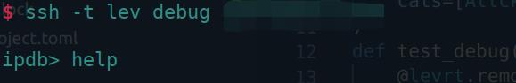
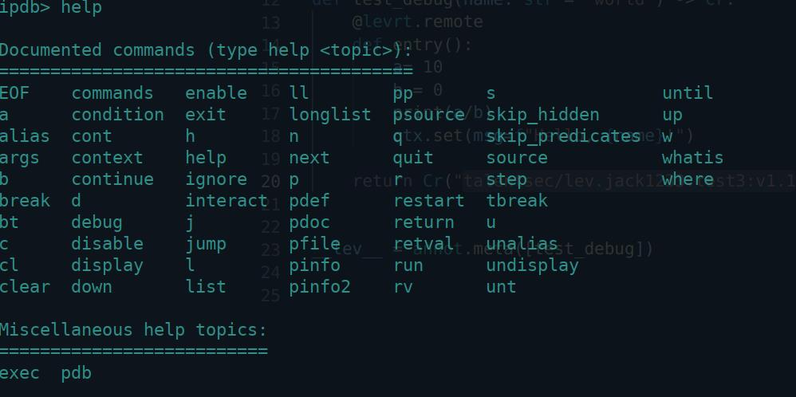

## Remote debugging

In the process of executing the task, it is very likely that unpredictable errors will occur, so Leviathan uses ipdb to provide additional remote debugging functions (you can only use this when there is an abnormal error, or the task will automatically exit once executed).

1. Create a new task on Leviathan.

   As in the previous example, nmap_python creates a new task and starts executing.

2. Click the Debug button on the task details page:
   

3. After clicking the button, a prompt box will appear, and you need to copy the command to run in the terminal.

   

4. After running the command, if there is no prompt in the terminal, then press the **Newline** key to enter the ipdb debugging mode
 (Note: there must exist a code execution error, similar to the 1/0 error in execution, before you can enter debugging. If there is no error, then the execution is completed. It will automatically exit and will not enter ipdb).

   

5. If you are not able to use ipdb, you can enter the `help` command to get help. 

   

6. Enter the variable name directly to print the value of the variable.


### Local debugging

If you want to view the files inside the container, you can use the `docker cp` command instead of directly using `docker start` to start the container. Restarting the container will cause the task re-executed, which may affect the previous output.

If you want to debug while testing locally, you can try to use the levrt.run() method to execute your schema or workflow locally.
And if you want to use pdb for breakpoint debugging locally, you need to import pdb under the remote method.


```python
def raw(argv:list[str]) -> Cr:
    @remote
    def entry(argv):
		import pdb
```

If you import it externally, it will be prompted that the module cannot be found.
