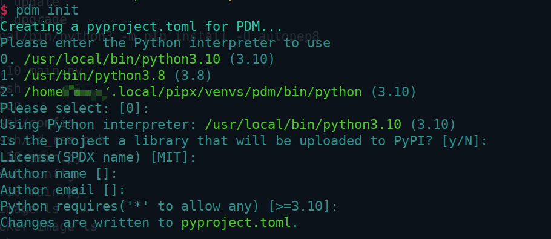
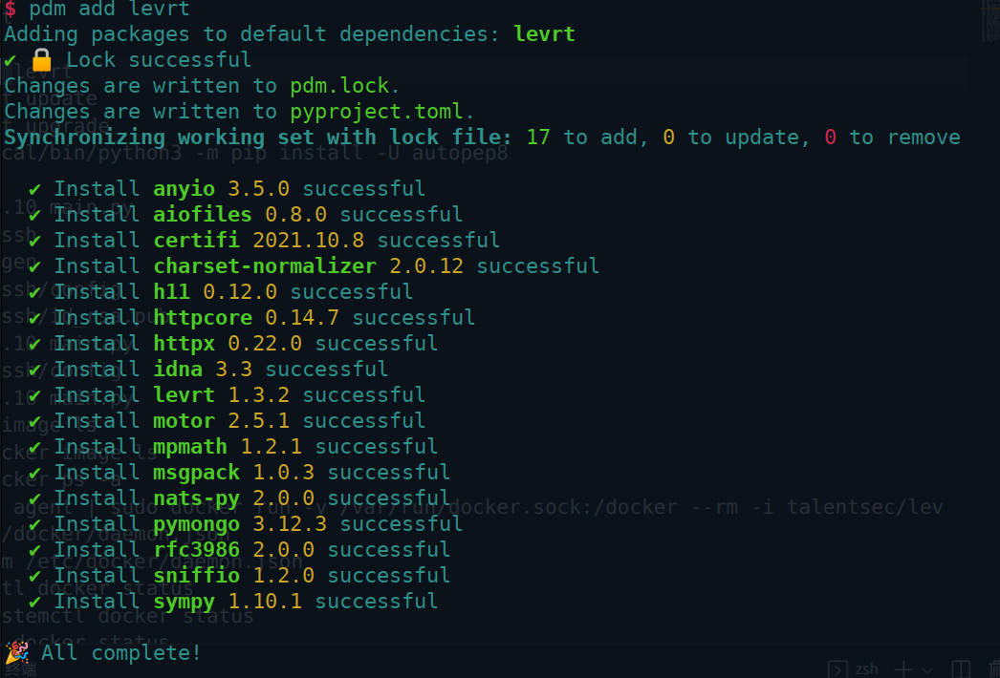
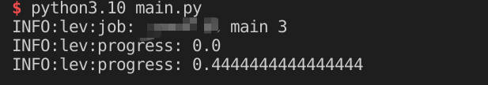
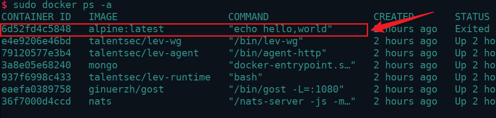

下面让我们来通过一个简单的例子来示范如何通过 python代码调用潮汐平台SDK

### 1. 基础配置

#### 1.1 建立并初始化工作区

首先创建一个 工作区文件夹 hello_world

```bash
$ mkdir hello-world
```

进入文件夹， 安装基础潮汐SDK：

```bash
$ cd hello-world
$ pdm init # 初始化工作区文件夹，会生成必须文件
$ pdm add levrt
```

然后会出现要求选择 python解释器版本等各种输入，不用管，一路 enter 键向下即可



直到屏幕出现 `changes are written to pyproject.toml` 的提示，表示初始化成功

#### 1.2 添加SDK

然后开始安装 潮汐SDK- levrt：

```bash
$ pdm add levrt
```

直到出现 `All Complete` 提示，表示成功



如此，初始环境配置完毕，最终会出现的目录结构为：

```bash
hello-world/
├── pdm.lock
├── .pdm.toml			# 隐藏文件，一般不显示
├── pyproject.toml
└── __package__/
```

### 

### 2. 编写 HelloWorld

在工作区( hello-world )下新建 `main.py` 文件，写入如下代码：

```python
import levrt
from levrt import Cr

def hello():
    return Cr("alpine:latest",cmd=["echo","hello,world"])


async def main():
    await hello()

if __name__ == "__main__":
    import logging

    import levrt

    logging.basicConfig()
    logger = logging.getLogger("lev")
    logger.setLevel(logging.DEBUG)

    levrt.run(main ())
```

本步骤暂不讲解代码的具体含义，先完成下面的运行步骤

### 3. 运行 HelloWorld

打开终端，进入 工作区文件夹内，直接调用 python命令 解释执行 main.py

```bash
$ cd hello-world
$ python3.10 main.py
```

出现类似下图所示日志，即为运行成功



### 4. 查看运行结果

在潮汐平台SDK中，用户所有的调用工具都是放在 docker 中运行，所以上一步显示的日志并不是最终的运行结果，最终运行结果需要进入 docker 中查看

输入 docker 命令：

```bash
$ docker ps -a
```

会出现下图所示内容，图中红框内的实例即是本次代码运行的实例：



输入打印日志的命令查看最终结果：

```bash
$ sudo docker logs -f 6d52
hello,world
```

成功打印出 "HelloWorld" 日志

Congratulations！您已经成功的调用了一次 潮汐SDK，并且在 容器内打印出了 "hello, world"！万里长征始于足下，相信您很快就能学会更多高级用法


### 5. 代码解析

```python
# 导入潮汐SDK - levrt包
import levrt
from levrt import Cr

# 主要功能方法，执行核心逻辑
def hello():
    # 执行结果写入docker中
    return Cr("alpine:latest",cmd=["echo","hello,world"])

# 异步方法封装，用户的每个功能方法都需要通过异步方法封装才可以供 levrt.run() 调用
async def main():
    await hello()

# 主函数,程序入口
if __name__ == "__main__":
    import logging

    import levrt
	# debug日志，可忽略
    logging.basicConfig()
    logger = logging.getLogger("lev")
    logger.setLevel(logging.DEBUG)
	# 调用 SDK 执行函数
    levrt.run(main ())
```
